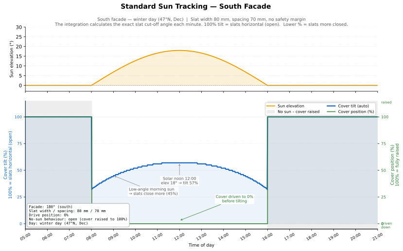
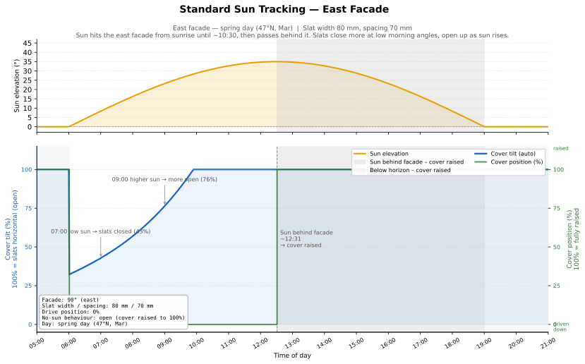
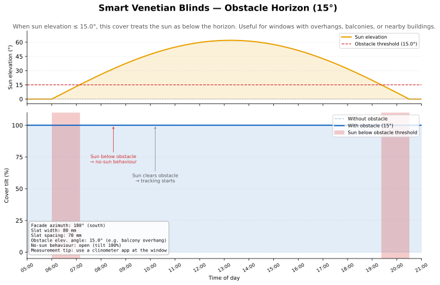
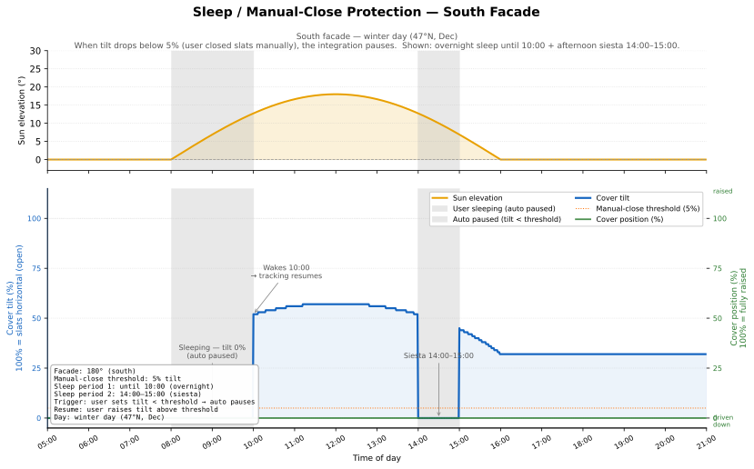
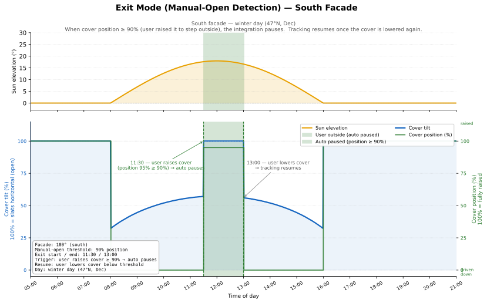

# Smart Venetian Blinds

[![GitHub Release][releases-shield]][releases]
[![GitHub Activity][commits-shield]][commits]
[![License][license-shield]](LICENSE)
[![Tests][tests-shield]][tests]

[![hacs][hacsbadge]][hacs]
![Project Maintenance][maintenance-shield]

A Home Assistant custom integration for automatic sun-position-driven venetian blind control. Calculates optimal slat angles based on sun position, facade orientation, and slat geometry to block direct sunlight while maximizing daylight.

## Features

- **Automatic slat angle calculation** based on real-time sun position
- **Per-window configuration** with facade azimuth and slat geometry
- **Multiple covers per window group** sharing the same facade orientation
- **Manual override detection** - won't disturb manually closed blinds
- **Daily Pause switch** per cover - manually pause and retract a cover, resume with one tap
- **Reflection protection** - prevents glare from reflected light (balconies/terraces)
- **Minimum tilt floor** - set a lower bound so covers never go below a configured openness
- **Throttling controls** to reduce motor wear, including a configurable settling delay after position drive

## Quick Start

### Installation via HACS (Recommended)

**Prerequisites:** [HACS](https://hacs.xyz/) (Home Assistant Community Store) must be installed.

1. Open HACS in your Home Assistant instance
2. Go to "Integrations"
3. Click the three dots in the top right corner
4. Select "Custom repositories"
5. Add this repository URL: `https://github.com/herpaderpaldent/ha-smart-venetian-blinds`
6. Set category to "Integration"
7. Click "Add"
8. Find "Smart Venetian Blinds" in the integration list
9. Click "Download"
10. **Restart Home Assistant**

### Manual Installation

1. Download the `custom_components/smart_venetian_blinds/` folder from this repository
2. Copy it to your Home Assistant's `custom_components/` directory
3. Restart Home Assistant

## Configuration

1. Go to **Settings** -> **Devices & Services** -> **Add Integration**
2. Search for "Smart Venetian Blinds"
3. Create a **Window Group** with:
   - Group name (e.g., "Living Room South")
   - Facade azimuth (compass direction the window faces: 0 deg=N, 90 deg=E, 180 deg=S, 270 deg=W)
   - Slat width in mm
   - Slat spacing in mm (measured bottom-to-bottom)
4. Add covers to the group

### Measuring Slat Geometry

Accurate measurements are critical for proper sun blocking:

- **Slat Width (L)**: Measure the actual width of each slat from edge to edge
- **Slat Spacing (d)**: Measure from the bottom edge of one slat to the bottom edge of the next slat (not the gap)

```
    +==============+  <- slat top
    |   slat (L)   |  <- measure this width
    +==============+  <- slat bottom
          | gap
    +==============+
    |   slat (L)   |  <- spacing (d) = bottom-to-bottom distance
    +==============+
```

## How It Works

The integration uses the sun's position (azimuth and elevation) combined with your window's facade direction and slat geometry to calculate the exact slat angle that blocks direct sunlight.

**Key formula:** `sin(theta + omega) = (d * cos(omega)) / L`

Where:

- theta = optimal slat angle
- omega = profile angle (vertical sun angle relative to facade)
- d = slat spacing
- L = slat width

### Behavior Diagrams

The diagrams below are generated directly from the integration's own [`calculate_slat_angle()`](custom_components/smart_venetian_blinds/sun/math.py) function — they always reflect the real code, never a simulation.

**South-facing facade (winter day)** — baseline tracking behaviour.
The cover drives down and tilts to block the sun; slats open slightly at noon when the sun is steepest.
Blue = tilt %, green = cover position % (right axis):



**East-facing facade (spring day)** — cover tracks the morning sun, then raises when the sun moves behind the facade at midday:



**Obstacle elevation** — a nearby building blocks the sun below 10°.
While the sun is below the threshold the integration treats it as no-sun and raises the cover:



**Sleep / manual-close protection** — when the user closes the slats below the threshold (e.g. overnight or during a siesta) the integration pauses and does not re-open:



**Exit mode (manual-open detection)** — when the user raises the cover above the threshold (e.g. to step outside) the integration pauses until the cover is lowered again:



### Data Flow

```
Sun Entity Changes -> Sun Listener -> Coordinator -> Cover Controller -> Cover Entities
                                           |
                                   Sensor Entities (calculated angles)
```

## Entities Created

For each **window group**:

| Entity | Description |
|--------|-------------|
| `switch.<group>_auto_control` | Enable/disable automatic control for the whole group |
| `sensor.<group>_slat_angle` | Calculated optimal slat angle (degrees) |
| `sensor.<group>_slat_tilt` | Calculated optimal tilt (percent) |
| `sensor.<group>_profile_angle` | Current profile angle — diagnostic, disabled by default |
| `number.<group>_slat_width` | Slat width setting (mm) |
| `number.<group>_slat_spacing` | Slat spacing setting (mm) |

For each **cover** added to a group:

| Entity | Description |
|--------|-------------|
| `switch.<cover>_exit_paused` | **Daily Pause** — turn ON to retract cover to 100% and pause tracking; turn OFF to resume immediately |

## Troubleshooting

See [Troubleshooting & Best Practices](docs/user/TROUBLESHOOTING.md) for common issues like:

- Sunlight coming through the blinds
- Correct slat measurement techniques
- Optimal threshold settings
- Diagnostic template for debugging

### Debug Logging

```yaml
logger:
  default: warning
  logs:
    custom_components.smart_venetian_blinds: debug
```

## Development

**Cloud Development (Recommended):**

[](https://codespaces.new/herpaderpaldent/ha-smart-venetian-blinds?quickstart=1)

**Local Development:**

```bash
# Run all checks
script/check

# Start local HA instance
./script/develop

# Run tests
script/test
```

See [Architecture](docs/development/ARCHITECTURE.md) for technical details.

## Contributing

Contributions are welcome! Please open an issue or pull request if you have suggestions or improvements.

## License

This project is licensed under the MIT License - see the [LICENSE](LICENSE) file for details.

---

**Made with care by [@herpaderpaldent][user_profile]**

---

[commits-shield]: https://img.shields.io/github/commit-activity/y/herpaderpaldent/ha-smart-venetian-blinds.svg?style=for-the-badge
[commits]: https://github.com/herpaderpaldent/ha-smart-venetian-blinds/commits/main
[hacs]: https://github.com/hacs/integration
[hacsbadge]: https://img.shields.io/badge/HACS-Custom-41BDF5.svg?style=for-the-badge
[license-shield]: https://img.shields.io/github/license/herpaderpaldent/ha-smart-venetian-blinds.svg?style=for-the-badge
[maintenance-shield]: https://img.shields.io/badge/maintainer-%40herpaderpaldent-blue.svg?style=for-the-badge
[releases-shield]: https://img.shields.io/github/release/herpaderpaldent/ha-smart-venetian-blinds.svg?style=for-the-badge
[releases]: https://github.com/herpaderpaldent/ha-smart-venetian-blinds/releases
[tests-shield]: https://github.com/herpaderpaldent/ha-smart-venetian-blinds/actions/workflows/tests.yml/badge.svg
[tests]: https://github.com/herpaderpaldent/ha-smart-venetian-blinds/actions/workflows/tests.yml
[user_profile]: https://github.com/herpaderpaldent
