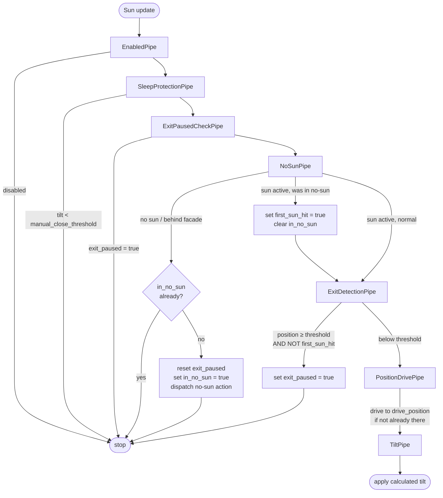

# Architecture Overview

This document describes the technical architecture of the Smart Venetian Blinds custom component for Home Assistant.

## Directory Structure

```text
custom_components/smart_venetian_blinds/
├── __init__.py              # Integration setup, sun listener wiring, event-driven cover control
├── config_flow.py           # Config flow entry point (delegates to config_flow_handler)
├── const.py                 # Constants and configuration keys
├── data.py                  # Runtime data types (SmartVenetianBlindsData)
├── diagnostics.py           # Diagnostic data for troubleshooting
├── manifest.json            # Integration metadata
├── repairs.py               # Repair flows for fixing issues
├── services.yaml            # Service action definitions
├── coordinator/             # Data update coordinator package
│   ├── __init__.py          # Exports SmartVenetianBlindsDataUpdateCoordinator
│   ├── base.py              # Main coordinator class
│   └── state.py             # GroupState (throttling, auto_control, no-sun tracking)
├── sun/                     # Sun position handling
│   ├── __init__.py
│   ├── provider.py          # SunDataProvider (reads sun.sun or solar sensors)
│   ├── listener.py          # SunStateListener (debounced state tracking)
│   └── math.py              # Slat angle calculations, SunPosition, SlatCalculationResult
├── cover_control/           # Cover tilt application
│   ├── __init__.py
│   ├── context.py           # CoverContext (per-cycle) and CoverTrackingState (persisted)
│   ├── controller.py        # CoverController, CoverConfig, Pipeline
│   └── pipes/               # Pipeline stages (chain of responsibility)
│       ├── __init__.py
│       ├── enabled.py       # EnabledPipe — skip disabled covers
│       ├── sleep_protection.py # SleepProtectionPipe — skip if tilt below threshold
│       ├── exit_paused.py   # ExitPausedCheckPipe — skip if exit_paused
│       ├── no_sun.py        # NoSunPipe — no-sun detection, dispatch, sunrise bypass
│       ├── exit_detection.py # ExitDetectionPipe — auto-detect manual open / exit mode
│       ├── position_drive.py # PositionDrivePipe — drive to target position
│       └── tilt.py          # TiltPipe — apply calculated tilt
├── config_flow_handler/     # Config flow implementation
│   ├── __init__.py          # Package exports
│   ├── handler.py           # Backward compatibility wrapper
│   ├── config_flow.py       # Main config flow (user setup, reconfigure)
│   ├── options_flow.py      # Options flow
│   ├── subentry_flow.py     # Cover subentry flow
│   ├── schemas/             # Voluptuous schemas
│   │   ├── __init__.py
│   │   ├── group.py         # Window group schemas
│   │   ├── cover_subentry.py # Cover subentry schemas
│   │   └── options.py       # Options flow schemas
│   └── validators/          # Input validation
│       └── __init__.py
├── entity/                  # Base entity package
│   ├── __init__.py          # Exports SmartVenetianBlindsEntity
│   └── base.py              # Base entity class implementation
├── entity_utils/            # Entity helper utilities
│   ├── __init__.py
│   └── device_info.py       # Device information helpers (create_window_group_device_info)
├── sensor/                  # Sensor platform (slat angle, sun position)
│   ├── __init__.py          # Platform setup
│   └── slat_sensors.py      # Slat angle and sun position sensor entities
├── switch/                  # Switch platform (auto_control toggle)
│   ├── __init__.py          # Platform setup
│   └── auto_control.py      # Auto control switch entity
├── service_actions/         # Service action implementations
│   ├── __init__.py
│   └── apply_now.py         # Force-apply current calculation to covers
├── utils/                   # General utilities
│   ├── __init__.py
│   └── string_helpers.py    # String manipulation helpers (slugify_name, truncate_string)
└── translations/            # Localization files
    ├── en.json              # English translations
    └── de.json              # German translations
```

## Core Components

### Sun Position Provider

**Directory:** `sun/`

The sun package reads solar position data and drives all integration updates. This integration has no external API — all computation is local based on sun position.

**Package structure:**

- `provider.py` - `SunDataProvider`: reads azimuth and elevation from `sun.sun` entity or dedicated solar sensors
- `listener.py` - `SunStateListener`: listens for sun entity state changes with debouncing to avoid excessive updates
- `math.py` - Core slat angle calculations given sun position, facade azimuth, and slat geometry (`SunPosition`, `SlatCalculationResult`)

### Data Update Coordinator

**Directory:** `coordinator/`

The coordinator receives sun position updates from the listener and computes optimal slat angles for each window group.

**Package structure:**

- `base.py` - Main coordinator class (`SmartVenetianBlindsDataUpdateCoordinator`)
- `state.py` - `GroupState` dataclass: holds calculation results, throttling state, auto-control flag, and per-cover tracking state (`cover_states`)

**Core functionality:**

- Event-driven updates triggered by sun position changes (not polling)
- Per-group throttling with configurable angle threshold and minimum interval
- Tracks whether sun has hit the facade in the current solar cycle
- One-shot no-sun action (open or reflection protection) when sun leaves facade

**Key class:** `SmartVenetianBlindsDataUpdateCoordinator` (exported from `coordinator/__init__.py`)

### Cover Controller

**Directory:** `cover_control/`

Applies calculated slat angles to physical cover entities via a **pipeline (chain of responsibility)**. Each pipe handles one concern and either short-circuits or passes control to the next pipe.

**Package structure:**

- `controller.py` - `CoverController`, `CoverConfig`, `Pipeline`
- `context.py` - `CoverContext` (per-cycle state) and `CoverTrackingState` (persisted per cover)
- `pipes/` - Individual pipeline stages

**Pipeline execution order:**



**`CoverTrackingState`** (persisted per cover in `GroupState.cover_states`):

| Field | Purpose |
|---|---|
| `exit_paused` | Set by auto exit-detection or user switch. Cleared at start of each no-sun period. |
| `in_no_sun` | True once the no-sun action has fired for the current no-sun period. Cleared when sun returns. |

**`CoverContext`** (per-cycle, not persisted):

| Field | Purpose |
|---|---|
| `first_sun_hit` | Set by `NoSunPipe` on the `in_no_sun → sun active` transition. Tells `ExitDetectionPipe` to skip this cycle to prevent false exit detection after `no_sun_behavior="open"` raised the cover to 100%. |

### Config Flow

**Directory:** `config_flow_handler/`

Implements the configuration UI for adding and configuring window groups and covers.

**Structure:**

- `config_flow.py`: Main flow (user setup, reconfigure)
- `options_flow.py`: Options flow for post-setup configuration
- `subentry_flow.py`: Cover subentry flow for adding individual covers to a group
- `schemas/`: Voluptuous schemas for group, cover, and options forms
- `validators/`: Input validation (`__init__.py` only)

**Key classes:**

- `SmartVenetianBlindsConfigFlowHandler` (main flow)
- `SmartVenetianBlindsOptionsFlow` (options)

### Base Entity

**Package:** `entity/`

Provides common functionality for all entities in the integration:

- Device information
- Unique ID generation (`{entry_id}_{description.key}`)
- Coordinator integration
- Availability tracking

**Key class:** `SmartVenetianBlindsEntity` (in `entity/base.py`)

## Platform Organization

Each platform (sensor, switch) follows this pattern:

```text
<platform>/
├── __init__.py              # Platform setup: async_setup_entry()
└── <entity_name>.py         # Individual entity implementation
```

**Current platforms:**

- `sensor/` - Slat angle and sun position sensors
- `switch/` - Auto control toggle per window group

Platform entities inherit from both:

1. Home Assistant platform base (e.g., `SensorEntity`)
2. `SmartVenetianBlindsEntity` for common functionality

## Data Flow

```text
Sun Entity Changes
       │
       ▼
┌──────────────────┐
│  SunStateListener │ ← Debounced state change tracking
└────────┬─────────┘
         │
         ▼
┌──────────────────┐
│   Coordinator    │ ← Calculates slat angles per group
└────────┬─────────┘
         │
    ┌────┴────────────────┐
    │                     │
    ▼                     ▼
┌─────────────┐    ┌────────────────┐
│ Sensor      │    │ CoverController│ ← Only if auto_control enabled
│ Entities    │    │ (drive + tilt) │
└─────────────┘    └────────────────┘
```

## Key Design Decisions

See [DECISIONS.md](./DECISIONS.md) for architectural and design decisions made during development.

## Extension Points

### Adding a New Platform

1. Create directory: `custom_components/smart_venetian_blinds/<platform>/`
2. Implement `__init__.py` with `async_setup_entry()`
3. Create entity classes inheriting from platform base + `SmartVenetianBlindsEntity`
4. Add platform to `PLATFORMS` in `const.py`

### Adding a New Service Action

1. Create service action handler in `service_actions/<service_name>.py`
2. Define service action in `services.yaml` with schema
3. Register service action in `__init__.py:async_setup()` (NOT `async_setup_entry`)

### Modifying Calculation Logic

1. Update sun math in `sun/math.py`
2. Adjust coordinator data processing if new inputs are needed
3. Update sensor entities to expose any new calculated values

## Testing Strategy

- **Unit tests:** Test individual functions and classes in isolation
- **Fixtures:** Shared test fixtures in `tests/conftest.py`

Tests mirror the source structure under `tests/unit/`:

- `tests/unit/sun/test_math.py` - Slat angle calculation tests
- `tests/unit/sun/test_provider.py` - Sun data provider tests
- `tests/unit/cover_control/test_controller.py` - Cover controller tests
- `tests/unit/coordinator/test_state.py` - Group state tests

## Dependencies

Core dependencies (see `manifest.json`):

- `sun` - Home Assistant sun integration (provides solar position data)
- Home Assistant (no minimum version pinned in manifest)

Development dependencies (see `requirements_dev.txt`, `requirements_test.txt`).
